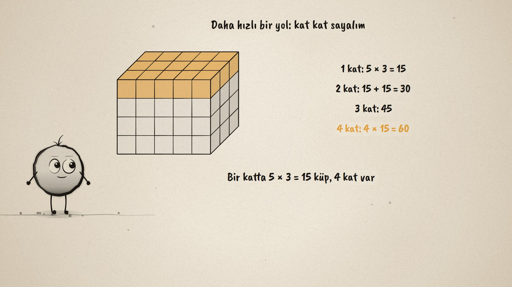
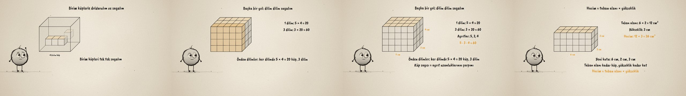

# Taban × Yükseklik · The Volume of a Rectangular Prism

**▶ Tarayıcıda izleyin / Watch in the browser:** https://hakanatas.github.io/taban-kere-yukseklik/ 
**⬇ MP4 + altyazılar / MP4 + subtitles:** [Releases](https://github.com/hakanatas/taban-kere-yukseklik/releases) 
**✎ Kullanılan istem / The prompt behind it:** [PROMPT.md](PROMPT.md) 
**🎞 Bütün filmler / All films:** [Nokta'nın Filmleri](https://hakanatas.github.io/nokta-filmleri/?sinif=7)

> **TR —** 7. sınıf matematik "Geometrik Nicelikler" temasındaki MAT.7.4.4 öğrenme çıktısı için hazırlanmış, tamamen JavaScript ile çizilen 92 saniyelik mürekkep animasyonu. Bir kutunun hacmini ölçmek için ölçüt seçiliyor: ayrıtı 1 cm olan birim küp, 1 cm³. Kutu birim küplerle dolduruluyor ve tek tek sayılıyor: 60 küp, hacim 60 cm³. Ama tek tek saymak uzun sürüyor. Önce kat kat sayılıyor: bir katta 5 × 3 = 15 küp, 4 kat, 4 × 15 = 60. Sonra önden dilim dilim: bir dilimde 5 × 4 = 20 küp, 3 dilim, 3 × 20 = 60. Küp sayısı ayrıt uzunluklarıyla karşılaştırılıyor: 5 · 3 · 4 = 60. Son olarak yeni bir kutuda bağıntı kuruluyor: taban alanı 6 × 2 = 12 cm², yükseklik 3 cm, hacim 12 × 3 = 36 cm³. Altyazılar Türkçe, İngilizce ya da ikisi birlikte seçilebilir.

A 92-second ink animation for **7th-grade maths**. Nokta, the ink character from [The Learning Ink](https://github.com/hakanatas/the-learning-ink), is the guide again. Each counting strategy is only a different arrival time for the same 60 cubes: `fillT` in `scenes/scene1.js` takes a function `when(cube)`, so one by one, layer by layer and slice by slice are three short timing rules, and the live counter is the number of cubes that have arrived.

## Learning outcome

MEB, Türkiye Yüzyılı Maarif Modeli, Ortaokul Matematik, 7th grade, "Geometrik Nicelikler" theme:

**MAT.7.4.4. Dikdörtgenler prizmasının hacim bağıntısını değerlendirebilme**
- a) Dikdörtgenler prizmasının hacmini belirlemede ölçüt olarak birim küpleri belirler.
- b) Dikdörtgenler prizmasının hacmini belirlemek için prizmaların içine yerleştirilen birim küpleri sayar.
- c) Toplam birim küp sayısı ile dikdörtgenler prizmasının ayrıt uzunluklarını karşılaştırır.
- ç) Birim küpleri farklı stratejilerle sayarak dikdörtgenler prizmasının hacmini taban alanı ile yüksekliğin çarpımı olarak ifade eder.

## Scenes

| # | Time | Scene | What happens | Outcome |
|---|---|---|---|---|
| 1 | 0–10 s | Kutu ve birim küp | The unit of measure: a 1 cm³ unit cube. | a |
| 2 | 10–28 s | Tek tek | The box is filled and counted one by one: 60 cm³. | b |
| 3 | 28–46 s | Kat kat | 15 cubes in a layer, 4 layers: 4 × 15 = 60. | ç |
| 4 | 46–64 s | Dilim dilim | 20 cubes in a slice, 3 slices; the edges 5, 3, 4 give 5 · 3 · 4 = 60. | c, ç |
| 5 | 64–80 s | Taban × yükseklik | A 6 × 2 × 3 box: base area 12 cm², height 3 cm, volume 36 cm³. | ç |
| 6 | 80–92 s | Aklında kalsın | Volume = base area × height. | a–ç |

## Running it

- **Preview:** double-click `index.html` (it works offline).
- **MP4:** run `npm install` once, then `npm run export -- --format=horizontal --captions=tr`.
- **Subtitles and narration:** `npm run srt` writes `out/captions_*.srt` and `narration_notes.txt`.
- **Editing:**
  - Caption text, timings and narration notes: `captions.js`
  - Everything on screen is drawn by `LI.world(t)` in `scenes/scene1.js` (the box, the cubes, the tallies, the words); the other scenes only set the camera.
  - Nokta's poses: `src/draw/film.js`; layout for 16:9 and 9:16: `src/draw/kd.js`

It uses the same engine as The Learning Ink: `renderFrame(t)` as a pure function of time, seeded randomness, and frame-by-frame export.

## Lisans · License

**TR —** Bu film ve kodu [Creative Commons Atıf-GayriTicari 4.0 Uluslararası (CC BY-NC 4.0)](https://creativecommons.org/licenses/by-nc/4.0/deed.tr) lisansıyla paylaşılır. Ticari olmayan her amaçla (derste, okulda, eğitim materyalinde) kopyalayabilir, paylaşabilir ve değiştirebilirsiniz; ancak **kaynak göstermek zorunludur**: eser sahibinin adı ve bu deponun bağlantısı belirtilmeden kullanılamaz. Ticari kullanım (satış, ücretli ürün ya da yayın) için izin alınmalıdır.

**EN —** This film and its code are licensed under [Creative Commons Attribution-NonCommercial 4.0 International (CC BY-NC 4.0)](https://creativecommons.org/licenses/by-nc/4.0/). You may copy, share and adapt them for non-commercial purposes, but **attribution is required**: they may not be used without crediting the author and linking to this repository. Commercial use requires permission.

Atıf örneği / Required credit: *“Taban × Yükseklik”, Hakan Ataş, Nokta'nın Filmleri — https://github.com/hakanatas/taban-kere-yukseklik — CC BY-NC 4.0*
